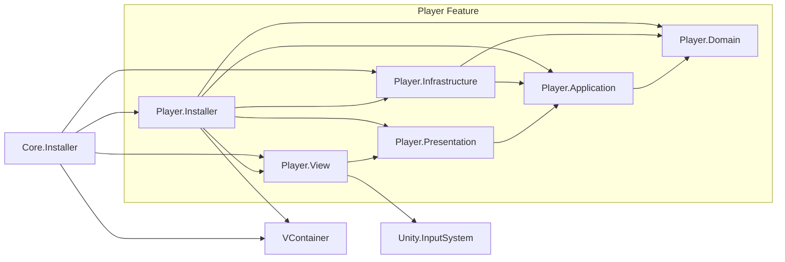
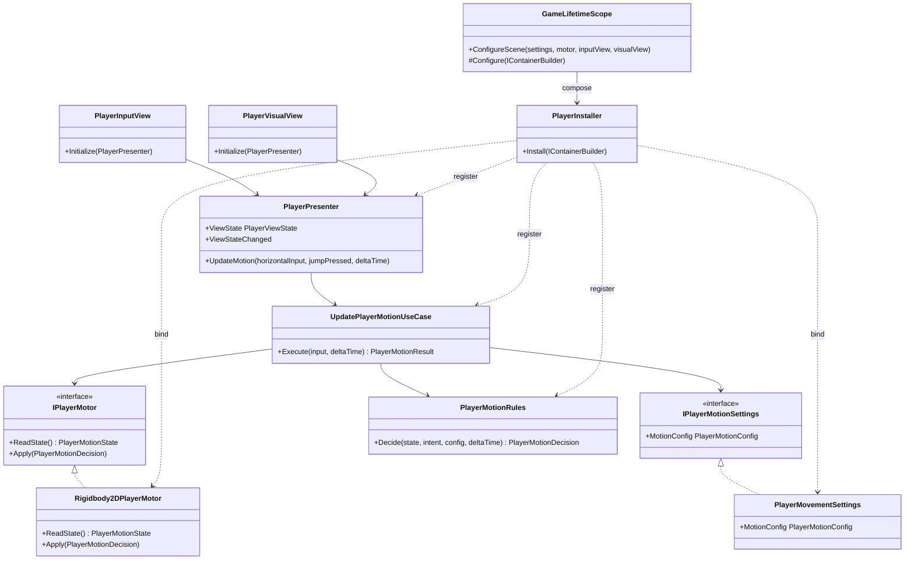
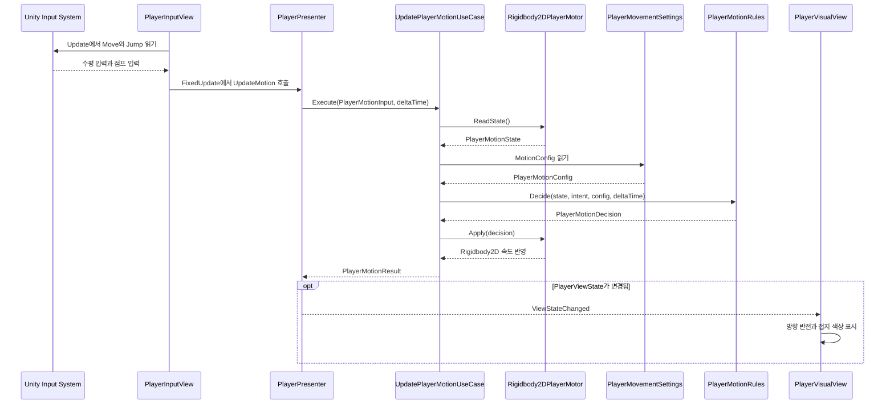
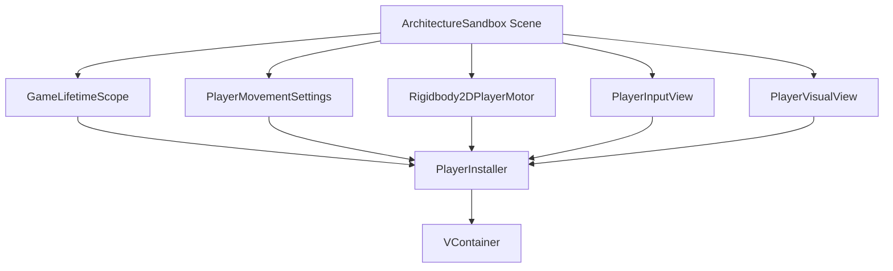

# 프로젝트 아키텍처

> 이 문서는 프로젝트 아키텍처의 상세 정본이다.
>
> 최종 코드 검증일: 2026-09-05<br>
> Unity 버전: 6000.3.20f1<br>
> 현재 구현 범위: Player 수평 이동과 접지 점프 세로 슬라이스

## 문서 원칙

- 실제 asmdef 참조와 실행되는 코드만 **현재 구조**로 기록한다.
- 아직 구현하지 않은 Feature와 계층은 현재 다이어그램에 미리 추가하지 않는다.
- 의존 방향은 안쪽 계층을 향하며, Unity와 외부 프레임워크는 바깥 계층에서만 사용한다.
- 의존성 생성과 연결은 Installer와 composition root가 소유한다.

## 현재 디렉터리 구조

```text
Assets/
├─ Core/
│  └─ Installer/          # 애플리케이션 composition root
├─ Content/
│  ├─ ThirdParty/         # 제작자·배포 팩별 외부 런타임 원재료
│  ├─ Generated/          # 생성형 런타임 원재료
│  └─ Game/               # Prefab·Animator·Material 등 게임 조립 에셋
├─ Feature/
│  └─ Player/
│     ├─ Domain/          # 순수 이동 규칙과 값 객체
│     ├─ Application/     # 이동 유스케이스와 외부 포트
│     ├─ Presentation/    # View에 전달할 상태와 명령
│     ├─ Infrastructure/  # Physics2D와 ScriptableObject 어댑터
│     ├─ View/            # Input System 입력과 시각 표현
│     └─ Installer/       # Player 의존성 등록
├─ Data/
│  └─ Player/             # Player 설정 ScriptableObject 인스턴스
├─ Scenes/
│  └─ ArchitectureSandbox.unity
└─ Tests/
   ├─ EditMode/Player/
   └─ PlayMode/Player/

SourceAssets/
├─ ThirdParty/            # Unity가 import하지 않는 다운로드 원본
└─ Generated/             # 생성 원본·프롬프트·편집 파일
```

`Shared`를 포함한 다른 Feature 디렉터리는 아직 실제 공통 계약이나 유스케이스가 없으므로 생성하지 않았다.

## 에셋 콘텐츠 파이프라인

에셋 출처와 라이선스의 정본은 [`Asset-Provenance.md`](Asset-Provenance.md)다.

```text
외부 다운로드 또는 AI 생성
            │
            ▼
      SourceAssets
  Unity 비import 원본 보존
            │
        선별·Export
            │
            ▼
 Assets/Content/ThirdParty|Generated
       런타임 원재료
            │
   Prefab·Animator·Material 조립
            │
            ▼
     Assets/Content/Game
        게임 소유 에셋
```

서드파티 원재료는 제작자와 배포 팩의 경계를 유지하고 직접 수정하지 않는다. 생성형 원재료는 서드파티와 분리해 생성 도구·프롬프트·참조 원본을 추적한다. 최종 Player·Enemy·UI 구성물은 원재료 출처와 무관하게 `Assets/Content/Game/`에서 소유하며, 리소스를 교체할 때 원재료를 이동하지 않고 Unity 참조만 바꾼다.

## 어셈블리 의존 관계

화살표 `A → B`는 A의 asmdef가 B를 직접 참조한다는 뜻이다.



### 어셈블리 계약

| 어셈블리 | 책임 | 직접 참조 | Unity 엔진 참조 차단 |
|---|---|---|---|
| `Player.Domain` | 이동 상태·의도·설정·결정과 순수 판정 규칙 | 없음 | 예 |
| `Player.Application` | 이동 유스케이스와 `IPlayerMotor`, `IPlayerMotionSettings` 포트 | `Player.Domain` | 예 |
| `Player.Presentation` | 표시 상태 생성과 View 알림 | `Player.Application` | 예 |
| `Player.Infrastructure` | Rigidbody2D 모터와 설정 ScriptableObject | `Player.Application`, `Player.Domain` | 아니요 |
| `Player.View` | Input System 입력 수집과 SpriteRenderer 표시 | `Player.Presentation`, `Unity.InputSystem` | 아니요 |
| `Player.Installer` | Player 객체 등록과 View 초기화 | 모든 Player 계층, `VContainer` | 아니요 |
| `Core.Installer` | 씬 참조 검증과 루트 DI 조립 | `Player.Infrastructure`, `Player.View`, `Player.Installer`, `VContainer` | 아니요 |

`Player.Domain`, `Player.Application`, `Player.Presentation`은 asmdef의 `noEngineReferences: true`로 Unity API 직접 사용을 컴파일 단계에서 차단한다.

## Player 주요 타입 UML

아래 클래스 다이어그램은 런타임 이동 경로와 DI 조립에 참여하는 주요 타입만 표시한다. 값 객체의 모든 필드와 Unity 내부 타입은 생략한다.



## Player 이동 런타임 시퀀스



`PlayerInputView.Update`는 입력을 수집하고 점프를 큐에 보관한다. 물리 상태 변경은 `FixedUpdate`에서 시작되며, Domain의 `PlayerMotionRules`가 속도와 점프 가능 여부를 결정한다. Infrastructure는 결정을 Rigidbody2D에 적용하고, Presentation은 결과를 `PlayerViewState`로 바꿔 View에 알린다.

## Composition root



`GameLifetimeScope`는 씬에서 설정과 Unity 어댑터 참조를 받고 누락 여부를 검증한다. `PlayerInstaller`는 포트 구현체와 순수 객체를 VContainer에 등록한 뒤, 빌드 콜백에서 `PlayerInputView`와 `PlayerVisualView`에 `PlayerPresenter`를 주입한다.

### 픽셀 아트 임포트와 회귀 방지

[`PixelArtTexturePostprocessor`](../Assets/Editor/PixelArtTexturePostprocessor.cs)는 `Assets/Content/`의 텍스처를 Sprite·PPU 32·Point·무압축·mipmap 해제·NPOT 원본 유지로 임포트한다. 기존 분할·피벗·Sprite Mode는 보존한다. Unity의 기본 Editor 어셈블리에만 속하며 런타임 Feature 계층이나 asmdef 그래프에는 참여하지 않는다. 출처 팩과 생성형 에셋에 같은 기준을 적용하며 상세 관리 규칙은 [에셋 출처 문서](Asset-Provenance.md)에 둔다.

## 의존 규칙

### 허용

```text
View ─────────▶ Presentation ─▶ Application ─▶ Domain
Infrastructure ───────────────▶ Application ─▶ Domain
Installer ─────▶ 필요한 Feature 계층과 DI 프레임워크
Core.Installer ─▶ Feature Installer와 씬 어댑터
```

### 금지

- Domain에서 Unity, VContainer 또는 바깥 계층 참조
- Application에서 Presentation, View, Infrastructure 또는 DI 프레임워크 참조
- Presentation에서 View, Infrastructure 또는 Unity UI 프레임워크 참조
- Infrastructure와 View 사이의 직접 참조
- View에서 Domain 규칙을 직접 실행하거나 Infrastructure 구현체를 직접 호출
- composition root 밖에서 임의로 Feature 객체 그래프 생성
- 실제 공유 계약 없이 `Shared`에 범용 타입을 선행 배치

새 Feature 간 협력이 필요하면 직접 구현체 참조를 먼저 추가하지 않는다. 소비자가 필요한 계약의 소유 위치와 composition root 조립 방식을 계획에서 결정하고, 실제 공통 소비자가 확인될 때만 공유 계층을 만든다.

## 코드 근거

| 문서 내용 | 현재 코드 근거 |
|---|---|
| 루트 composition | [`GameLifetimeScope.cs`](../Assets/Core/Installer/GameLifetimeScope.cs) |
| Player DI 등록 | [`PlayerInstaller.cs`](../Assets/Feature/Player/Installer/PlayerInstaller.cs) |
| 입력 진입점 | [`PlayerInputView.cs`](../Assets/Feature/Player/View/PlayerInputView.cs) |
| 표시 갱신 | [`PlayerVisualView.cs`](../Assets/Feature/Player/View/PlayerVisualView.cs) |
| Presentation 상태 변환 | [`PlayerPresenter.cs`](../Assets/Feature/Player/Presentation/PlayerPresenter.cs) |
| Application 유스케이스 | [`UpdatePlayerMotionUseCase.cs`](../Assets/Feature/Player/Application/UpdatePlayerMotionUseCase.cs) |
| 외부 포트 | [`IPlayerMotor.cs`](../Assets/Feature/Player/Application/IPlayerMotor.cs) |
| 순수 이동 판정 | [`PlayerMotionRules.cs`](../Assets/Feature/Player/Domain/PlayerMotionRules.cs) |
| Physics2D 구현 | [`Rigidbody2DPlayerMotor.cs`](../Assets/Feature/Player/Infrastructure/Rigidbody2DPlayerMotor.cs) |
| 설정 구현 | [`PlayerMovementSettings.cs`](../Assets/Feature/Player/Infrastructure/PlayerMovementSettings.cs) |

어셈블리 직접 참조의 최종 근거는 각 계층의 `.asmdef` 파일이다. 산문이나 다이어그램이 실제 코드와 다르면 asmdef와 실행 코드를 먼저 확인하고 이 문서를 수정한다.

## 유지보수 계약

다음 변경은 `Docs/Architecture.md` 갱신을 같은 작업의 완료 조건으로 포함한다.

- asmdef 추가·삭제·이름 변경
- asmdef `references` 또는 `noEngineReferences` 변경
- 계층의 책임이나 주요 타입 소유권 이동
- Feature 간 의존 추가·제거
- Installer 또는 composition root 조립 변경
- 입력부터 Domain·Infrastructure·View로 이어지는 주요 런타임 흐름 변경

### 자동 강제 범위

로컬 `.githooks/pre-commit`은 staged 변경을 기준으로 다음 구조 변경을 감지한다.

- 모든 `.asmdef` 변경
- `Assets/Core/`, `Assets/Feature/` 아래 C# 타입의 추가·삭제·이동·복사
- `Installer/` 아래 `.meta`가 아닌 파일 변경
- `Assets/Scenes/ArchitectureSandbox.unity` 변경

구조 변경이 감지되면 `Docs/Architecture.md`가 같은 커밋에 staged되어야 한다. 문서가 staged된 커밋에서는 Node 기본 모듈 기반 검사기가 staged snapshot의 런타임 asmdef와 문서를 비교해 다음 항목을 검증한다.

- 어셈블리 노드와 직접 참조 간선
- `noEngineReferences` 계약 표 값
- Mermaid 코드 블록의 닫힘 여부
- 문서의 로컬 코드 링크가 Git index에 존재하는지

일반 메서드 본문 수정이 계층 책임이나 주요 런타임 흐름을 바꾸는지는 정적 경로만으로 정확히 판별할 수 없다. 이 의미 기반 변경은 `AGENTS.md`의 계획·완료 검증 규칙이 보완한다.

Mermaid CLI와 npm 패키지는 설치하지 않는다. VS Code 미리보기로 시각적 배치와 가독성을 사람이 확인하며, 로컬 훅은 외부 렌더러 없이 구조적 정합성만 검사한다.

갱신할 때는 다음 순서를 지킨다.

1. 실제 asmdef와 코드 본문을 먼저 확인한다.
2. 현재 디렉터리, 의존 그래프, 계약 표, UML 중 영향을 받는 부분을 수정한다.
3. 문서 상단의 최종 코드 검증일과 현재 구현 범위를 갱신한다.
4. 구현하지 않은 예정 구조를 현재 구조와 분리한다.
5. 해당 작업의 개발 기록에 아키텍처 문서 변경과 검증 근거를 남긴다.
