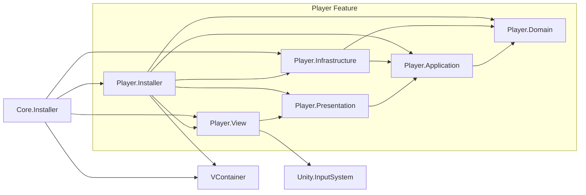
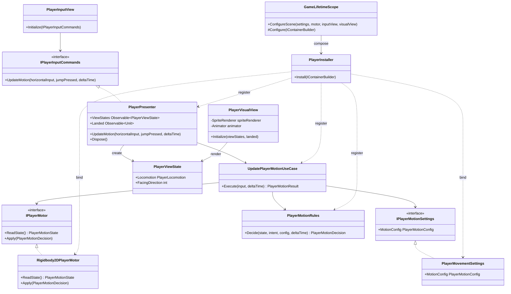
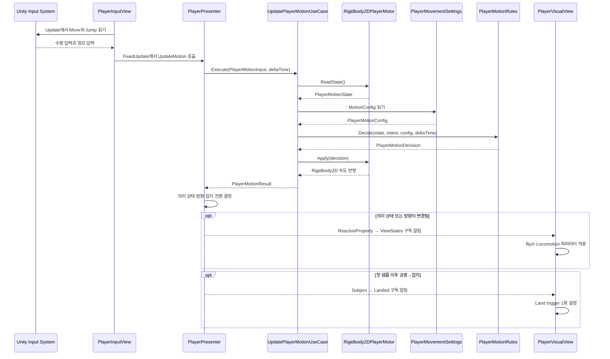
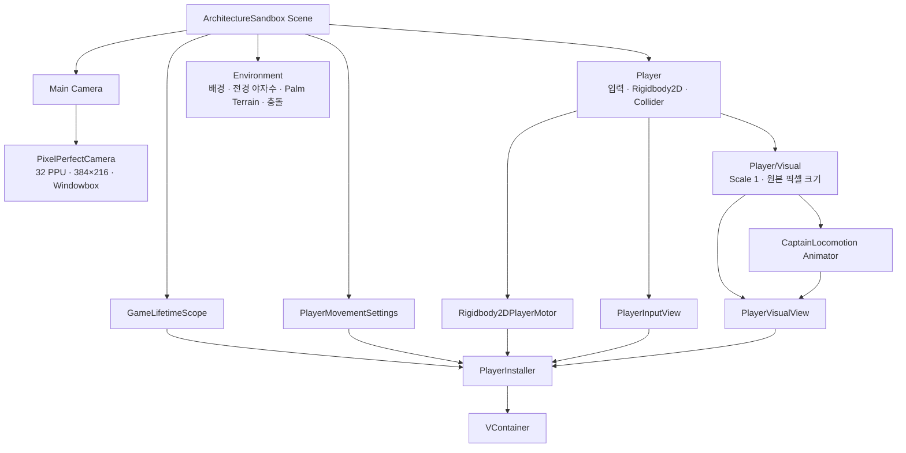

# 프로젝트 아키텍처

> 이 문서는 프로젝트 아키텍처의 상세 정본이다.
>
> 최종 코드 검증일: 2026-09-05<br>
> Unity 버전: 6000.3.20f1<br>
> 현재 구현 범위: Player 수평 이동·접지 점프, R3 표현 상태 발행과 Treasure Hunters 시각 데모

## 문서 원칙

- 실제 asmdef 참조와 실행되는 코드만 **현재 구조**로 기록한다.
- 아직 구현하지 않은 Feature와 계층은 현재 다이어그램에 미리 추가하지 않는다.
- 의존 방향은 안쪽 계층을 향한다. Domain·Application은 순수 이동 규칙과 유스케이스를 소유하며, Presentation은 상태 발행을 위해 R3 core를 사용한다. Unity API와 R3.Unity는 Presentation 안에 들이지 않고 DI 조립은 Installer가 소유한다.
- 의존성 생성과 연결은 Installer와 composition root가 소유한다.

## 현재 디렉터리 구조

```text
Assets/
├─ Core/
│  └─ Installer/          # 애플리케이션 composition root
├─ Content/
│  ├─ ThirdParty/         # 제작자·배포 팩별 외부 런타임 원재료
│  ├─ Generated/          # 생성형 런타임 원재료
│  └─ Game/               # 게임이 소유하는 조립 에셋
│     ├─ Environment/
│     │  └─ Tiles/        # Palm Tree Island 데모 Tile
│     └─ Player/
│        ├─ Animations/   # 10 FPS 이동 AnimationClip
│        └─ Animator/     # Captain 이동 상태 머신
├─ Feature/
│  └─ Player/
│     ├─ Domain/          # 순수 이동 규칙과 값 객체
│     ├─ Application/     # 이동 유스케이스와 외부 포트
│     ├─ Presentation/    # View에 전달할 상태와 명령
│     ├─ Infrastructure/  # Physics2D와 ScriptableObject 어댑터
│     ├─ View/            # Input System 입력과 시각 표현
│     └─ Installer/       # Player 의존성 등록
├─ Data/
│  └─ Player/             # Player 설정 ScriptableObject 인스턴스
├─ Scenes/
│  └─ ArchitectureSandbox.unity
└─ Tests/
   ├─ EditMode/Player/
   └─ PlayMode/Player/

SourceAssets/
├─ ThirdParty/            # Unity가 import하지 않는 다운로드 원본
└─ Generated/             # 생성 원본·프롬프트·편집 파일
```

`Shared`를 포함한 다른 Feature 디렉터리는 아직 실제 공통 계약이나 유스케이스가 없으므로 생성하지 않았다.

## 에셋 콘텐츠 파이프라인

에셋 출처와 라이선스의 정본은 [`Asset-Provenance.md`](Asset-Provenance.md)다.

```text
외부 다운로드 또는 AI 생성
            │
            ▼
      SourceAssets
  Unity 비import 원본 보존
            │
        선별·Export
            │
            ▼
 Assets/Content/ThirdParty|Generated
       런타임 원재료
            │
   Prefab·Animator·Material 조립
            │
            ▼
     Assets/Content/Game
        게임 소유 에셋
```

서드파티 원재료는 제작자와 배포 팩의 경계를 유지하고 직접 수정하지 않는다. 생성형 원재료는 서드파티와 분리해 생성 도구·프롬프트·참조 원본을 추적한다. 최종 Player·Enemy·UI 구성물은 원재료 출처와 무관하게 `Assets/Content/Game/`에서 소유하며, 리소스를 교체할 때 원재료를 이동하지 않고 Unity 참조만 바꾼다.

## 어셈블리 의존 관계

화살표 `A → B`는 A의 asmdef가 B를 직접 참조한다는 뜻이다.



### 어셈블리 계약

| 어셈블리 | 책임 | 직접 참조 | Unity 엔진 참조 차단 |
|---|---|---|---|
| `Player.Domain` | 이동 상태·의도·설정·결정과 순수 판정 규칙 | 없음 | 예 |
| `Player.Application` | 이동 유스케이스와 `IPlayerMotor`, `IPlayerMotionSettings` 포트 | `Player.Domain` | 예 |
| `Player.Presentation` | 이동 결과를 의미 상태로 결정하고 R3 상태·착지 신호 발행 | `Player.Application` | 예 |
| `Player.Infrastructure` | Rigidbody2D 모터와 설정 ScriptableObject | `Player.Application`, `Player.Domain` | 아니요 |
| `Player.View` | 명령 포트로 Input System 입력 전달, 읽기 전용 흐름으로 SpriteRenderer·Animator 출력 | `Player.Presentation`, `Unity.InputSystem` | 아니요 |
| `Player.Installer` | Player 등록, 입력 명령·출력 흐름 연결과 소스 수명 소유 | 모든 Player 계층, `VContainer` | 아니요 |
| `Core.Installer` | 씬 참조 검증과 루트 DI 조립 | `Player.Infrastructure`, `Player.View`, `Player.Installer`, `VContainer` | 아니요 |

`Player.Domain`, `Player.Application`, `Player.Presentation`은 asmdef의 `noEngineReferences: true`로 Unity API 직접 사용을 컴파일 단계에서 차단한다.

R3 core는 `Assets/Packages/R3.1.3.1/lib/netstandard2.1/R3.dll`의 NuGet DLL이다. 런타임 asmdef는 `overrideReferences: false`와 DLL의 자동 참조 설정을 사용하므로 위 asmdef 그래프에 `R3` 노드나 간선을 추가하지 않는다. Presentation·View는 R3 core API를 사용하지만 `R3.Unity` asmdef를 참조하지 않는다. Domain·Application 코드에는 R3 사용이 없다. `noEngineReferences`는 Unity API를 차단하며 외부 DLL의 자동 참조 자체를 차단하는 설정은 아니다.

테스트 어셈블리는 런타임 의존 그래프에 포함하지 않는다. `CleanArchitecture.Player.EditModeTests`는 `Player.Domain`, `Player.Application`, `Player.Presentation`을 직접 참조해 이동 규칙·유스케이스와 의미 상태·착지·R3 계약을 검증한다. `CleanArchitecture.Player.PlayModeTests`는 기존 `Core.Installer`, `Player.Domain`, `Player.Infrastructure`, `Player.Presentation`, `VContainer`에 더해 `Player.View`, `Player.Application`, `Unity.InputSystem`을 직접 참조한다. 실제 데모 조립·입력·Animator·View 수명·컨테이너 종료를 검증한다. 두 테스트 asmdef는 `overrideReferences: true`, `precompiledReferences: [R3.dll, nunit.framework.dll]`로 테스트에 필요한 DLL을 명시한다.

## Player 주요 타입 UML

아래 클래스 다이어그램은 런타임 이동 경로와 DI 조립에 참여하는 주요 타입만 표시한다. 값 객체의 모든 필드와 Unity 내부 타입은 생략한다.



## Player 이동 런타임 시퀀스



`PlayerInputView.Update`는 입력을 수집하고 점프를 큐에 보관한다. `FixedUpdate`에서 `IPlayerInputCommands.UpdateMotion`을 호출하고 큐를 소비한다. 비활성화 시 입력 액션을 끄고 큐와 수평 입력을 초기화한다. 입력 어댑터는 출력 상태를 구독하거나 Animator를 조작하지 않는다.

Domain의 `PlayerMotionRules`가 속도와 점프 가능 여부를 결정하고, Infrastructure가 Rigidbody2D에 적용한다. Presentation은 Application 결과로 `Idle / Run / Jump / Fall`과 방향을 결정한다. 수평 속도 절댓값 기준은 0.05, 상승·낙하 기준은 0.01, 방향 입력 deadzone은 0.0001이다. 임계값과 정확히 같으면 같은 상태군의 직전 표현을 유지하고 새 상태군에서는 Idle/Fall을 기본값으로 한다. 초기 출력은 오른쪽을 보는 Idle이며 첫 실제 접지 샘플만으로 착지를 만들지 않는다.

`PlayerPresenter`는 private `ReactiveProperty<PlayerViewState>`와 `Subject<Unit>`를 소유하고 `AsObservable()`로 감싼 `ViewStates`와 `Landed`만 공개한다. 지속 상태를 먼저 갱신한 뒤 관측된 공중→접지 전환의 착지를 한 번 발행한다. 동일한 의미 상태·방향은 재발행하지 않으며 속도 수치만 바뀌는 경우 View가 클립을 재시작하지 않는다. 지속 상태 구독은 최신값을 즉시 받지만, 착지 신호는 구독 이전 것을 재전달하지 않는다.

`PlayerVisualView`는 Presenter 전체 대신 두 `Observable`을 받는다. SpriteRenderer 방향 반전과 의미 상태→Animator `Locomotion` int, 착지→`Land` trigger 매핑을 수행한다. Controller에는 속도·접지의 판정 조건이 없다. 기존 5개 10 FPS 클립과 0.05초 전환을 사용한다. Land는 정규화 재생률 0.9 이후 최신 Idle/Run으로 복귀하며 Jump/Fall 출력으로 중단될 수 있다. 클립 길이·종료 시점·블렌딩은 Unity 출력 책임이므로 Presentation에 클립 시간을 넣지 않는다.

### 구독과 소스 수명

출력 View는 초기화되고 활성화된 기간에만 구독한다. `Initialize`가 `OnEnable` 전후 어느 쪽에서 호출돼도 한 번만 연결하며 재초기화는 기존 두 구독을 먼저 해제한다. `OnDisable`·`OnDestroy`는 구독과 pending Land trigger를 정리한다. 재활성화 시 최초 전달된 최신 의미 상태로 Animator를 동기화하고, 비활성화 중 발생한 착지나 이전 Land 클립을 재생하지 않는다. 소스 완료 시에도 구독을 해제하며 종료된 소스에 자동 재구독하지 않는다.

View가 해제하는 것은 구독 핸들이며 발행 객체가 아니다. `PlayerPresenter.Dispose`가 소유한 두 R3 객체를 완료·해제한다. 기존 VContainer singleton 등록은 이 IDisposable을 추적하고 `GameLifetimeScope` 종료 시 해제한다. R3의 `ReadOnlyReactiveProperty`도 Dispose를 노출하므로 출력 API에는 해당 타입을 직접 공개하지 않는다.

`Player.View` 어셈블리는 Unity 입력·출력 어댑터를 함께 소유한다. 출력 전용 경계는 `PlayerVisualView`에 적용하며, 입력을 별도 계층이나 갱신 루프로 옮기지 않는다. 구현·검증 근거는 [DEV-011](development-record/DEV-2026-011-player-reactive-presentation.md)에 보관한다.

### 별도 범위의 접지 판정

`Rigidbody2DPlayerMotor.ReadState`는 여전히 `IsTouchingLayers`로 접지를 판단하며 바닥과 옆면 방향을 구분하지 않는다. Presentation은 이 결과를 별도 속도 조건으로 덮어쓰지 않으므로 옆면 접촉의 착지 오신호 가능성도 남는다. 이 수정은 이동 로직의 별도 작업이다.

## Composition root



`GameLifetimeScope`는 씬에서 설정과 Unity 어댑터 참조를 받고 누락 여부를 검증한다. `PlayerInstaller`는 포트 구현체와 순수 객체를 VContainer에 등록한 뒤, 빌드 콜백에서 `PlayerInputView`에는 Presenter의 `IPlayerInputCommands` 계약을, `PlayerVisualView`에는 `ViewStates`와 `Landed` 흐름을 전달한다.

`ArchitectureSandbox`는 32 PPU를 타일·배경·캐릭터의 공통 픽셀 밀도로 사용한다. `Main Camera`의 URP `PixelPerfectCamera`는 384×216 참조 해상도, `UpscaleRenderTexture`, `CropFrame.Windowbox`로 16:9 구도와 정수배 출력을 유지한다. 기본 출력은 FHD 1920×1080(5배)이며 uloop 768×432(2배)에서도 같은 12×6.75유닛 영역을 보여 준다. 비정수배 해상도에서는 남는 영역을 여백으로 처리한다.

같은 Camera에 URP 렌더링 보조 컴포넌트 `UniversalAdditionalCameraData`도 저장돼 있다. 게임 입력·물리·DI 계층에는 관여하지 않는다.

Player 루트는 입력·Rigidbody2D·BoxCollider2D를, 자식 `Visual`은 SpriteRenderer·Animator·PlayerVisualView를 소유한다. 루트와 시각 자식 모두 Scale `(1,1,1)`이며, Captain 원본의 투명 여백을 고려해 Visual의 로컬 Y는 -0.0625, 충돌체 크기는 0.625×0.875유닛으로 맞췄다. 크기를 바꾸려고 개별 PPU나 Transform 배율을 변경하지 않는다. 좌우 반전은 `SpriteRenderer.flipX`를 사용한다.

`Environment`는 `Background`의 Sky·Base·Clouds·Water 레이어, `Decorations`의 조립식 Front Palm Tree, 1×1 Grid의 Palm Terrain Tilemap, 별도 BoxCollider2D 충돌 영역을 소유한다. 배경은 원본 크기와 타일링으로 채우고, 야자수는 Scale 1의 줄기 세 개와 수관 한 개로 조립한다. 지면·중앙·좌우 플랫폼의 윗면은 각각 Y=-2·-1·0으로 기존 이동 로직의 점프 범위 안에서 연결한다.

### 픽셀 아트 임포트와 회귀 방지

[`PixelArtTexturePostprocessor`](../Assets/Editor/PixelArtTexturePostprocessor.cs)는 `Assets/Content/`의 텍스처를 Sprite·PPU 32·Point·무압축·mipmap 해제·NPOT 원본 유지로 임포트한다. 기존 분할·피벗·Sprite Mode는 보존한다. Unity의 기본 Editor 어셈블리에만 속하며 런타임 Feature 계층이나 asmdef 그래프에는 참여하지 않는다. 출처 팩과 생성형 에셋에 같은 기준을 적용하며 상세 관리 규칙은 [에셋 출처 문서](Asset-Provenance.md)에 둔다.

`PlayerMovementSmokeTests`는 씬의 모든 Transform과 부모 배율, Sprite·Tile의 PPU, Grid 셀 크기와 Tile 변환, 카메라 Crop, 접지 정렬을 검사한다. 배율을 런타임에서 몰래 덮어쓰는 보정 코드는 추가하지 않는다. 원본 측정·적용·검증 기록은 [DEV-2026-009](development-record/DEV-2026-009-treasure-hunters-playable-demo.md)에 보관한다.

## 의존 규칙

### 허용

```text
View ─────────▶ Presentation ─▶ Application ─▶ Domain
Infrastructure ───────────────▶ Application ─▶ Domain
Installer ─────▶ 필요한 Feature 계층과 DI 프레임워크
Core.Installer ─▶ Feature Installer와 씬 어댑터
```

### 금지

- Domain에서 Unity, VContainer 또는 바깥 계층 참조
- Application에서 Presentation, View, Infrastructure 또는 DI 프레임워크 참조
- Presentation에서 View, Infrastructure 또는 Unity UI 프레임워크 참조
- Infrastructure와 View 사이의 직접 참조
- View에서 Domain 규칙을 직접 실행하거나 Infrastructure 구현체를 직접 호출
- composition root 밖에서 임의로 Feature 객체 그래프 생성
- 실제 공유 계약 없이 `Shared`에 범용 타입을 선행 배치

새 Feature 간 협력이 필요하면 직접 구현체 참조를 먼저 추가하지 않는다. 소비자가 필요한 계약의 소유 위치와 composition root 조립 방식을 계획에서 결정하고, 실제 공통 소비자가 확인될 때만 공유 계층을 만든다.

## 코드 근거

| 문서 내용 | 현재 코드 근거 |
|---|---|
| 루트 composition | [`GameLifetimeScope.cs`](../Assets/Core/Installer/GameLifetimeScope.cs) |
| Player DI 등록 | [`PlayerInstaller.cs`](../Assets/Feature/Player/Installer/PlayerInstaller.cs) |
| 입력 진입점 | [`PlayerInputView.cs`](../Assets/Feature/Player/View/PlayerInputView.cs) |
| 입력 명령 계약 | [`IPlayerInputCommands.cs`](../Assets/Feature/Player/Presentation/IPlayerInputCommands.cs) |
| 표시 갱신 | [`PlayerVisualView.cs`](../Assets/Feature/Player/View/PlayerVisualView.cs) |
| Presentation 상태 변환 | [`PlayerPresenter.cs`](../Assets/Feature/Player/Presentation/PlayerPresenter.cs) |
| 의미 상태와 방향 값 | [`PlayerViewState.cs`](../Assets/Feature/Player/Presentation/PlayerViewState.cs) |
| Application 유스케이스 | [`UpdatePlayerMotionUseCase.cs`](../Assets/Feature/Player/Application/UpdatePlayerMotionUseCase.cs) |
| 외부 포트 | [`IPlayerMotor.cs`](../Assets/Feature/Player/Application/IPlayerMotor.cs) |
| 순수 이동 판정 | [`PlayerMotionRules.cs`](../Assets/Feature/Player/Domain/PlayerMotionRules.cs) |
| Physics2D 구현 | [`Rigidbody2DPlayerMotor.cs`](../Assets/Feature/Player/Infrastructure/Rigidbody2DPlayerMotor.cs) |
| 설정 구현 | [`PlayerMovementSettings.cs`](../Assets/Feature/Player/Infrastructure/PlayerMovementSettings.cs) |
| 데모 씬 | [`ArchitectureSandbox.unity`](../Assets/Scenes/ArchitectureSandbox.unity) |
| Captain Animator | [`CaptainLocomotion.controller`](../Assets/Content/Game/Player/Animator/CaptainLocomotion.controller) |

어셈블리 직접 참조의 최종 근거는 각 계층의 `.asmdef` 파일이다. 산문이나 다이어그램이 실제 코드와 다르면 asmdef와 실행 코드를 먼저 확인하고 이 문서를 수정한다.

## 유지보수 계약

다음 변경은 `Docs/Architecture.md` 갱신을 같은 작업의 완료 조건으로 포함한다.

- asmdef 추가·삭제·이름 변경
- asmdef `references` 또는 `noEngineReferences` 변경
- 계층의 책임이나 주요 타입 소유권 이동
- Feature 간 의존 추가·제거
- Installer 또는 composition root 조립 변경
- 입력부터 Domain·Infrastructure·View로 이어지는 주요 런타임 흐름 변경

### 자동 강제 범위

로컬 `.githooks/pre-commit`은 staged 변경을 기준으로 다음 구조 변경을 감지한다.

- 모든 `.asmdef` 변경
- `Assets/Core/`, `Assets/Feature/` 아래 C# 타입의 추가·삭제·이동·복사
- `Installer/` 아래 `.meta`가 아닌 파일 변경
- `Assets/Scenes/ArchitectureSandbox.unity` 변경

구조 변경이 감지되면 `Docs/Architecture.md`가 같은 커밋에 staged되어야 한다. 문서가 staged된 커밋에서는 Node 기본 모듈 기반 검사기가 staged snapshot의 런타임 asmdef와 문서를 비교해 다음 항목을 검증한다.

- 어셈블리 노드와 직접 참조 간선
- `noEngineReferences` 계약 표 값
- Mermaid 코드 블록의 닫힘 여부
- 문서의 로컬 코드 링크가 Git index에 존재하는지

일반 메서드 본문 수정이 계층 책임이나 주요 런타임 흐름을 바꾸는지는 정적 경로만으로 정확히 판별할 수 없다. 이 의미 기반 변경은 `AGENTS.md`의 계획·완료 검증 규칙이 보완한다.

Mermaid CLI와 npm 패키지는 설치하지 않는다. VS Code 미리보기로 시각적 배치와 가독성을 사람이 확인하며, 로컬 훅은 외부 렌더러 없이 구조적 정합성만 검사한다.

갱신할 때는 다음 순서를 지킨다.

1. 실제 asmdef와 코드 본문을 먼저 확인한다.
2. 현재 디렉터리, 의존 그래프, 계약 표, UML 중 영향을 받는 부분을 수정한다.
3. 문서 상단의 최종 코드 검증일과 현재 구현 범위를 갱신한다.
4. 구현하지 않은 예정 구조를 현재 구조와 분리한다.
5. 해당 작업의 개발 기록에 아키텍처 문서 변경과 검증 근거를 남긴다.
